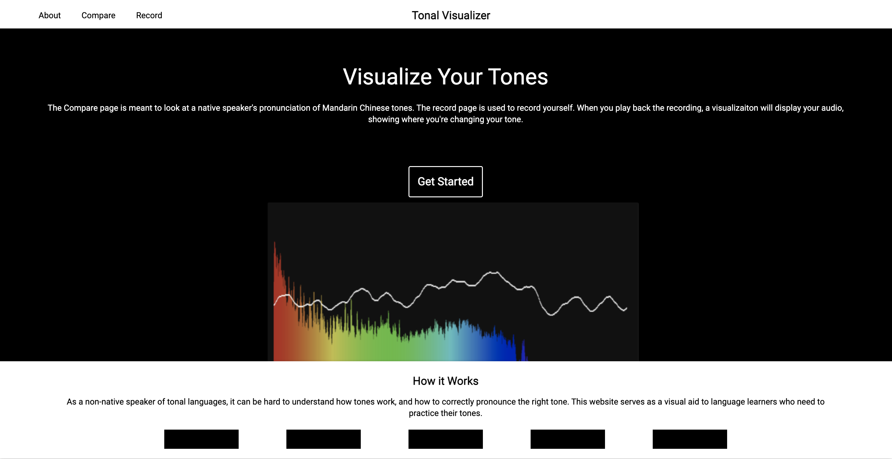
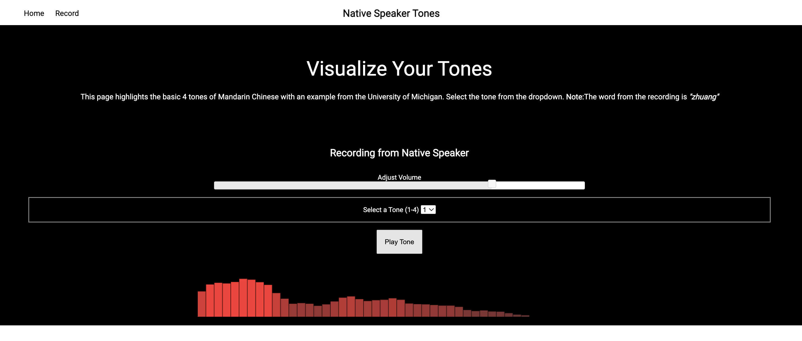
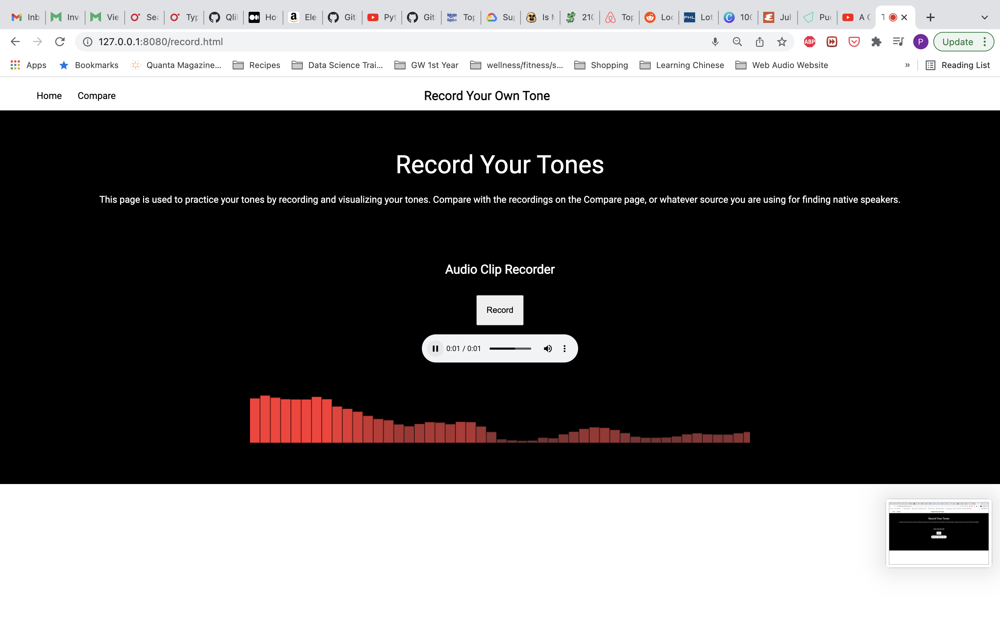

# Tonal-Visualizer

This project was to gain further experience with javascript and jquery, specifically with more complex DOM Manipulation.
I wanted to practice my Mandarin, but needed other ways of evaluating my tones. 

##### A simple website used to record your own tones and compare with selected recordings. Note: these recordings are found at Michigan State University's online library https://tone.lib.msu.edu/. 

##### Plays recording of selected tone. Future modifications would be to incorporate text-to-speech APIs for more dynamic recording. 

##### Compare native speaker's tonal fluctuation with your own. A future modification for this page would be to incorporate deep learning models to evaluate user performance, alongside the visualization.

Note: I used jquery version jquery-ui-1.12.1 in the coding of this practice website.

