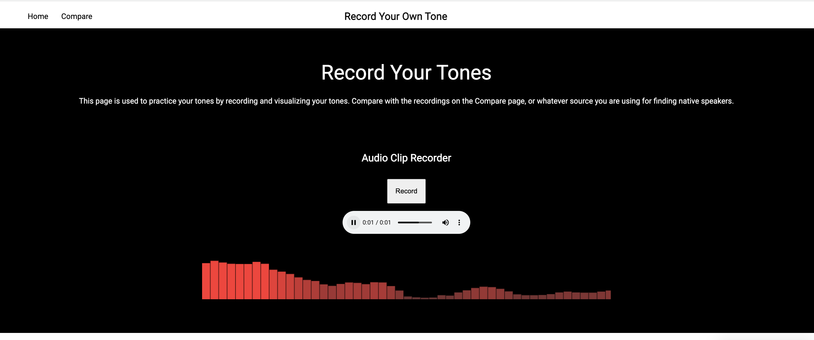

# Tonal-Visualizer

### This project was to gain further experience with javascript and jquery, specifically with more complex DOM Manipulation.
### I wanted to practice my Mandarin, but needed other ways of evaluating my tones. 

## A simple website used to record your own tones and compare with selected recordings. Note: these recordings are found at Michigan State University's online library https://tone.lib.msu.edu/. 

